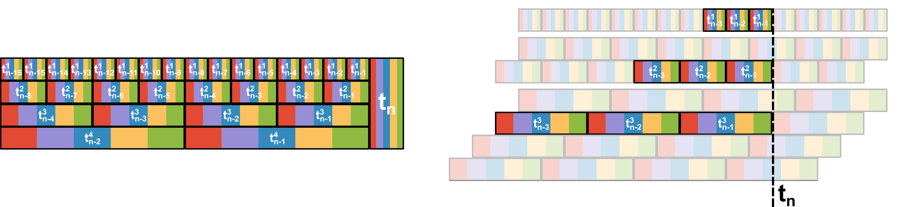

# Crypto data acquisition, processing, and analysis
We have multiple data sources with historical crypto-trade data. I was focused on the data provided by [Binance](https://data.binance.vision/) because they are easily available and given in a raw form (we can download lists of trades that describe all events that have occurred on the market; unfortunately historical data from the order book are not available).
Raw data in this form does not lose information, but in this form it is not suitable for use by supervised ML algorithms. In the series of notebooks included in this repository, I present the process of acquiring, exploring, cleaning and normalizing data, generating additional features, and creating a dataset containing reasonable X and Y batches for ML.

## Assumptions and concepts
When creating this project, I wanted to use a few concepts that can be useful when processing financial data.

### Technical Analysis

"In finance, [technical analysis](https://en.wikipedia.org/wiki/Technical_analysis) is an analysis methodology for analysing and forecasting the direction of prices through the study of past market data, primarily price and volume."\
Many indicators have been developed that domain experts consider helpful in estimating future changes in assets. The functions defining these metrics cannot always be easily approximated by neural networks or other ML algorithms because they contain, for example, integrals, differential equations, or other functions that are difficult to approximate by additive layers even with nonlinear activations between them. On the other hand, since these metrics help experts in their analysis, they may be important features that will also help our ML algorithms. That is why I am extending the input of our dataset with appropriately processed technical analysis indicators, i.e. normalized in the right way. I am starting from a slightly naive assumption that these features carry information, I do not know what a specific metric represents, based only on statistical analysis I cluster them into appropriate groups, and for each group I use a properly designed standardization process.

### Time series representation
Financial data is a multivariate time series, for example: open, high, low, close, volume for each time step (plus additional features derived from technical analysis). We wanted to take into account the longest possible time horizon, however, we wanted a high temporal resolution of observations, especially recorded just before the prediction period. For example, information about a short price peak 5 minutes ago before the estimate period may have a significant impact, but such event one month ago is probably irrelevant, from a longer time horizon, we will be interested only in phenomena with a longer duration.

So I decided to represent single time series as a set of time series of different granularity, as was shown on figure below (left). 
For each selected time series, features such as open, close, low, high, volume and other technical analysis indicators are calculated independently.
Here comes the advantage of having raw trade event list data from which we can compute OHLCV formats for any time ranges.
It is important that the time windows of individual intervals end at the same moment.
Therefore, larger intervals must be multiples of the base interval, and must have several versions with different offsets.
Figure below (right) shows how the sampling process and individual inputs data sample look like. In this way, the input data is relatively small, we can use long time horizon, and the most recent data are presented with high granularity. 

|  |
|:--:|
| **Left**: One time series can be represented as a set of time series with different time resolution. **Right**: An example of selecting an input sample. For simplicity (and shortening the figure), the length of the time series is 3 for all intervals.
The end of last time interval for all time series is the same and is t_n.
The base interval, shown above, determines the base width of the time window,
and the intervals of the middle and lower time series are its multiples (2 and 4, respectively, hence the number of series with different offsets). |

## Data normalization
I divided the input features into several categories: features strongly correlated with price, characterized by a fat-tailed distribution, representing the occurrence of candlestick patterns, etc. Provided notebooks accurately describes the processing of individual groups of features, e.g. features related to price are divided by the price value in the last time step, and standardized, thanks to which we can compare assets with different relative values and we focus on predicting the rate of return rather than the absolute value. Standardization also means that small fluctuations from the most recent, narrowest time horizon are not lost in comparison with the long time horizon in which much larger percentage changes will occur. For some features, such as volume, I use a power transform to normalize fat-tailed distributions.

## Notebooks
The repository contains the following notebooks:

[1_binance_download.ipynb](1_binance_download.ipynb) - In this notebook, I show you downloading raw data from Binance, containing a record of all trade events, and how to convert it to OHLC data. I set technical indicators and save the processed data.\
[2_ohlc_exploration.ipynb](2_ohlc_exploration.ipynb) - Data mining from the previous notebook, looking at features, removing unnecessary ones, finding missing values, etc. I also cluster features from technical analysis.\
[3_data_preprocessing.ipynb](3_data_preprocessing.ipynb) - In this notebook, I identify problems specific to each group of acquired features and normalize them in a way specific to them. e.g.
I use the power transform for features such as volume and similar, I project the values of candlestick patterns to the range [0, 1], check the values of the correlation matrix.\
[4_data_save.ipynb](4_data_save.ipynb) - I wrap the previously performed analyzes and operations into a class that enables the automated building of a data set, test this solution and save the obtained data to various file formats.\
[5_sample_generator.ipynb](5_sample_generator.ipynb) - I load the data prepared in the previous notebook and create a data generator that returns properly prepared batches, such as in the picture above.
I have created a flexible mechanism for creating a variety of Y values. The generator can be easily modified. Then I test the consistency of the generated data, and draw graphs that give a better intuition of how our dataset is formed.\
[6_complete_use.ipynb](6_complete_use.ipynb) - Everything stacked together. Example of use, downloading and processing data and instantiate the sample generator.

The last notebook shows how to get data ready for further analysis through a relatively arbitrary supervised machine learning model. However, this is a research project and I strongly recommend that you familiarize yourself with all notebooks in order to better understand the general concept and the individual data processing steps.